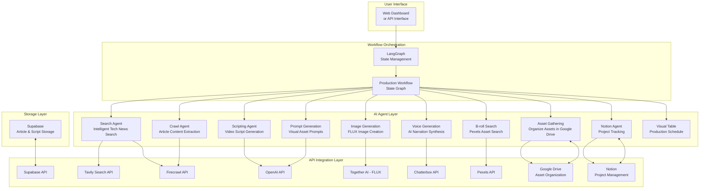
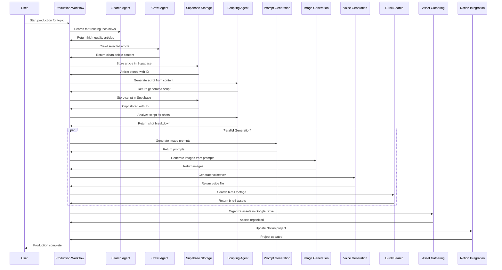

# Rocket Reels AI - Automated Content Creation Pipeline

An advanced multi-agent AI platform for automated content creation, from research and scriptwriting to visual asset generation and production management. This system orchestrates multiple AI agents to transform trending tech news into fully-produced social media content using LangGraph for workflow management and various AI services for content generation.

## Demo Video

[](https://www.youtube.com/watch?v=UB6DAETz3Lk)

*Watch our automated content creation pipeline in action - Click to play on YouTube*

---

## Table of Contents
1. [Features](#features)
2. [System Architecture](#system-architecture)
3. [Directory Structure](#directory-structure)
4. [Installation & Setup](#installation--setup)
5. [Running the Application](#running-the-application)
6. [AI Agent Components](#ai-agent-components)
7. [Workflow Orchestration](#workflow-orchestration)
8. [Storage & Integration](#storage--integration)
9. [Technical Implementation](#technical-implementation)
10. [Testing](#testing)
11. [Cost Management](#cost-management)
12. [Extending the System](#extending-the-system)
13. [Troubleshooting](#troubleshooting)

## Features

### Core Capabilities
- **Multi-Agent Architecture**: Specialized AI agents for research, content creation, and asset generation
- **LangGraph Orchestration**: Advanced workflow management with error handling and parallel processing
- **End-to-End Automation**: Complete pipeline from research to final video assets
- **Multi-Source Research**: Fetches tech news from Tavily, NewsAPI, and direct web crawling
- **Intelligent Script Generation**: AI-powered script creation optimized for social media format
- **Visual Asset Production**: Image generation with FLUX models, b-roll search from Pexels
- **Voice Generation**: AI voiceover synthesis for video narrations

### Advanced Features
- **Shot-by-Shot Analysis**: AI-powered shot breakdown for video production
- **Google Drive Integration**: Automated asset organization with topic-based subfolders
- **Notion Workspace Management**: Project tracking and monitoring integration
- **Parallel Processing**: Simultaneous image, voice, and b-roll generation
- **Cost Management**: Built-in cost tracking and limits to prevent excessive usage
- **Cross-Platform Publishing**: Ready for multi-platform content distribution

## System Architecture



## Directory Structure

```
D:\Kirmada\workflow\
│
├── .env                        # Environment variables and API keys
├── .gitignore                  # Git ignore patterns
├── credentials.json            # Google Drive OAuth credentials
├── token.json                  # Google Drive access tokens
│
├── agents/                     # AI agent implementations
│   ├── asset_gathering_agent.py    # Organize generated assets in Google Drive
│   ├── broll_search_agent.py       # Find b-roll footage from Pexels
│   ├── crawl_agent.py              # Web content crawling
│   ├── image_generation_agent.py   # AI image generation with FLUX
│   ├── notion_agent.py             # Notion workspace integration
│   ├── prompt_generation_agent.py  # Generate visual asset prompts
│   ├── scripting_agent.py          # Script generation from articles
│   ├── search_agent.py             # Intelligent tech news search
│   ├── supabase_agent.py           # Database storage operations
│   ├── visual_table_agent.py       # Production table generation
│   └── voice_generation_agent.py   # AI voiceover generation (using Chatterbox)
│
├── core/                       # Core workflow orchestration
│   └── production_workflow.py      # Main LangGraph workflow implementation
│
├── storage/                    # Storage and integration services
│   ├── gdrive_storage.py           # Google Drive integration
│   └── upload_to_gdrive.py         # Asset upload utilities
│
├── assets/                     # Generated assets
│   └── generated_images/           # AI-generated images
│
├── temp_broll/                 # Temporary b-roll storage
│
└── __pycache__/                # Python cache files (auto-generated)
```

## Installation & Setup

### Prerequisites
- Python 3.8 or higher
- pip package manager
- Git for version control
- Google Drive account with API access

### 1. Clone the Repository
```bash
git clone <repository_url>
cd Kirmada/workflow
```

### 2. Create Virtual Environment
```bash
# Create virtual environment
python -m venv .venv

# Activate virtual environment
# On Windows:
.venv\Scripts\activate
# On macOS/Linux:
source .venv/bin/activate
```

### 3. Install Dependencies
```bash
pip install -r ../requirements.txt
```

### 4. Environment Configuration
Create a `.env` file in the workflow directory based on the example in `workflow/.env`:
```env
# LangGraph Configuration
OPENAI_API_KEY=your_openai_api_key
CLAUDE_API_KEY=your_claude_api_key
TAVILY_API_KEY=your_tavily_api_key
FIRECRAWL_API_KEY=your_firecrawl_api_key

# Image Generation APIs
TogetherAI_API_KEY=your_togetherai_api_key
PEXELS_API_KEY=your_pexels_api_key

# Voice Generation
CHATTERBOX_API_KEY=your_chatterbox_api_key

# Database Storage
SUPABASE_URL=your_supabase_url
SUPABASE_ANON_KEY=your_supabase_anon_key

# Google Drive Integration
GOOGLE_APPLICATION_CREDENTIALS=credentials.json

# Notion Integration
NOTION_API_KEY=your_notion_api_key
NOTION_DATABASE_ID=your_notion_database_id

# Cost Limits
COST_LIMIT_PER_REEL=0.50
COST_LIMIT_DAILY=10.00
```

### 5. Google Drive Setup
1. Go to [Google Cloud Console](https://console.cloud.google.com/)
2. Create a new project or select an existing one
3. Enable the Google Drive API
4. Create credentials (OAuth 2.0 Client ID)
5. Download the credentials JSON file
6. Rename it to `credentials.json` and place it in the workflow directory
7. Run the application once to complete OAuth flow and create `token.json`

### 6. Initialize the System
The application will automatically create necessary directories and authenticate services on first run.

## Running the Application

### Direct Execution
```bash
# From the workflow directory
python -m asyncio -c "from core.production_workflow import run_production_workflow; import asyncio; asyncio.run(run_production_workflow('latest tech breakthrough'))"
```

### Integration in Backend
The workflow can be integrated into the main backend application through the LangGraph service.

### Access the Workflow
The workflow runs as a background service that:
- Automatically discovers trending tech news
- Generates AI scripts for social media
- Creates visual assets (images, voiceovers)
- Organizes assets in Google Drive
- Updates Notion workspace with project status

## AI Agent Components

### Search Agent (`agents/search_agent.py`)
- **Purpose**: Finds high-quality, standalone tech news articles
- **Techniques**: AI-powered search queries, Firecrawl validation, result ranking
- **Features**: 
  - Intelligent query optimization
  - Quality filtering to avoid aggregated content
  - Validation with Firecrawl API
  - Domain-based prioritization for official sources

### Crawl Agent (`agents/crawl_agent.py`)
- **Purpose**: Extracts clean content from web articles
- **Techniques**: Web scraping with Firecrawl, content cleaning
- **Features**:
  - Handles JavaScript-rendered content
  - Extracts article metadata
  - Cleans HTML to plain text
  - Handles various website formats

### Scripting Agent (`agents/scripting_agent.py`)
- **Purpose**: Generates engaging YouTube-style scripts from articles
- **Techniques**: LLM-powered text generation with structure
- **Features**:
  - 60-second video script format
  - Hook and section structure (INTRODUCTION, MAIN, CONCLUSION)
  - Visual suggestions for each section
  - Metadata extraction for production planning

### Image Generation Agent (`agents/image_generation_agent.py`)
- **Purpose**: Creates visual assets using AI models
- **Techniques**: FLUX Schnell model via Together AI
- **Features**:
  - 9:16 aspect ratio for social media
  - Prompt enhancement for quality images
  - Batch processing capabilities
  - Google Drive storage integration

### Prompt Generation Agent (`agents/prompt_generation_agent.py`)
- **Purpose**: Generates detailed visual prompts from scripts
- **Techniques**: LLM-based prompt engineering
- **Features**:
  - Shot-specific prompt generation
  - Style and mood optimization
  - Visual timing alignment
  - Quality scoring for prompts

### Voice Generation Agent (`agents/voice_generation_agent.py`)
- **Purpose**: Generates AI voiceovers for video scripts
- **Techniques**: API integration with Chatterbox
- **Features**:
  - Natural-sounding narration
  - Emotion and tone control
  - Audio file format conversion
  - Google Drive storage

### B-roll Search Agent (`agents/broll_search_agent.py`)
- **Purpose**: Finds relevant b-roll footage from Pexels
- **Techniques**: API integration with Pexels
- **Features**:
  - Keyword-based search
  - Quality filtering
  - Automatic download and organization
  - Metadata tracking

### Notion Agent (`agents/notion_agent.py`)
- **Purpose**: Integrates with Notion workspaces for project tracking
- **Techniques**: Notion API integration
- **Features**:
  - Project database entry creation
  - Status tracking and updates
  - Link generation to assets
  - Progress monitoring

## Workflow Orchestration

### Production Workflow (`core/production_workflow.py`)
The main LangGraph workflow orchestrates all agents in a multi-step process:



### State Management (`WorkflowState`)
The workflow maintains comprehensive state across all steps:

```python
@dataclass
class WorkflowState:
    # Input parameters
    user_query: str = ""
    topic: str = ""
    
    # Search phase
    search_results: str = ""
    search_urls: List[str] = field(default_factory=list)
    
    # Crawl phase
    article_data: Dict[str, Any] = field(default_factory=dict)
    crawled_content: str = ""
    
    # Storage phase
    article_id: str = ""
    storage_result: str = ""
    
    # Script generation phase
    script_content: str = ""
    script_hook: str = ""
    visual_suggestions: List[str] = field(default_factory=list)
    script_id: str = ""
    
    # Shot analysis phase
    shot_breakdown: List[Dict[str, Any]] = field(default_factory=list)
    shot_timing: List[Dict[str, Any]] = field(default_factory=list)
    shot_types: List[str] = field(default_factory=list)
    
    # Parallel generation phase
    prompts_generated: Annotated[List[Dict], add] = field(default_factory=list)
    images_generated: Annotated[List[str], add] = field(default_factory=list)
    voice_files: Annotated[List[str], add] = field(default_factory=list)
    broll_assets: Dict[str, Any] = field(default_factory=dict)
    
    # Asset gathering phase
    project_folder_path: str = ""
    asset_organization_result: str = ""
    
    # Notion integration phase
    notion_project_id: str = ""
    notion_status: str = ""
    
    # Status tracking
    current_step: str = "search"
    errors: Annotated[List[str], add] = field(default_factory=list)
    messages: Annotated[List[BaseMessage], add] = field(default_factory=list)
```

### Error Handling & Recovery
- Each node implements comprehensive error handling
- Failed steps preserve partial results for recovery
- Workflow state is preserved across execution
- Automatic retry mechanisms for transient failures

## Storage & Integration

### Google Drive (`storage/gdrive_storage.py`)
- Automated folder structure creation
- Topic-based subfolder organization
- Thread-safe file upload with duplicate prevention
- Cache management for performance optimization
- OAuth2 authentication with token refresh

### Supabase Integration (`agents/supabase_agent.py`)
- Article content storage with metadata
- Script storage with associated metadata
- Relational data management
- Query and retrieval capabilities
- Error handling and retry logic

### Notion Workspace (`agents/notion_agent.py`)
- Project tracking database integration
- Status updates and monitoring
- Asset linking and organization
- Progress visualization
- Team collaboration features

## Technical Implementation

### Agent Architecture
Each agent follows the LangChain tool pattern:

```python
@tool
async def agent_function_name(parameters) -> str:
    """
    Comprehensive docstring explaining the agent's function.
    
    Args:
        parameters: Detailed parameter descriptions
        
    Returns:
        Formatted response with structured information
    """
    # Implementation with error handling
    try:
        # Agent logic
        result = perform_action()
        return format_result(result)
    except Exception as e:
        return format_error(str(e))
```

### Parallel Processing
The workflow implements intelligent parallel processing:
- Prompt generation, image creation, voice synthesis, and b-roll search run in parallel
- Synchronization point to ensure all assets are ready before organization
- Resource management to prevent API rate limit issues
- Error propagation handling between parallel branches

### Cost Management
- Built-in cost tracking per reel and daily limits
- API usage monitoring
- Automatic stopping when cost thresholds are met
- Detailed cost breakdown in final reports

### Quality Control
- Intelligent content filtering to avoid aggregated content
- Quality validation of generated assets
- Multiple quality checks at each step
- Automatic retry mechanisms for failed generations

## Testing

### Running Tests
```bash
# Test individual agents
python -m pytest tests/test_agents.py

# Test workflow orchestration
python -m pytest tests/test_workflow.py

# Test storage integration
python -m pytest tests/test_storage.py

# Run all tests with coverage
python -m pytest --cov=workflow tests/
```

### Test Coverage
- **Agent Functionality**: Individual agent behavior and error handling
- **Workflow Execution**: End-to-end workflow completion
- **Storage Operations**: File upload and organization
- **API Integration**: Third-party service integration
- **Error Handling**: Graceful failure and recovery

## Cost Management

### Built-in Cost Controls
The system includes several cost management features:
- **Per-reel limits**: $0.50 per reel production
- **Daily limits**: $10.00 daily spending cap
- **API key rotation**: Automatic key switching if limits are reached
- **Generation quality**: Optimal balance between quality and cost

### Cost Breakdown
- **OpenAI API**: Script generation (~$0.02-0.05 per reel)
- **Together AI**: Image generation with FLUX (~$0.05-0.10 per reel)
- **Pexels**: B-roll search (free tier available)
- **Chatterbox**: Voice generation (~$0.05-0.08 per reel)
- **Google Drive**: Storage and API calls (free tier available)

## Extending the System

### Adding New Agents

1. **Create a new agent file**:
```python
# agents/new_agent.py
from langchain_core.tools import tool

@tool
async def new_agent_function(input_data: str) -> str:
    """
    New agent to perform specific function
    """
    # Implementation
    pass

new_agent_tools = [
    new_agent_function
]
```

2. **Register the agent in the workflow**:
```python
# In production_workflow.py
from agents.new_agent import new_agent_tools

# Add to state
class WorkflowState:
    # ... other fields
    new_agent_result: str = ""

# Add node to workflow
self.workflow.add_node("new_agent_step", self.new_agent_node)
self.workflow.add_edge("previous_step", "new_agent_step")
```

### Customizing Generation Parameters
- Adjust image generation settings (dimensions, style, quality)
- Modify script length and structure parameters
- Customize voice model and emotion settings
- Configure Google Drive folder structure

### Integrating New Platforms
1. Add new publishing APIs (YouTube, TikTok, Instagram)
2. Create platform-specific optimization agents
3. Extend Notion templates with new platform fields
4. Add platform-specific cost tracking

## Troubleshooting

### Common Issues

#### 1. Authentication Failures
**Symptoms**: "Invalid API key", "Authentication failed"
**Solutions**:
```bash
# Verify API keys are correctly set
env | grep -i api_key

# Re-authenticate Google Drive
rm token.json
# Run the script again to complete OAuth flow
```

#### 2. Rate Limit Errors
**Symptoms**: "Rate limit exceeded", "Too many requests"
**Solutions**:
- Add multiple API keys for rotation
- Implement delays between requests
- Check daily usage limits on all services
- Use lower-cost alternatives when available

#### 3. Image Generation Failures
**Symptoms**: No images generated, "Model not available"
**Solutions**:
```bash
# Install required dependencies
pip install together

# Check model availability
python -c "from agents.image_generation_agent import check_image_generation_status; import asyncio; asyncio.run(check_image_generation_status())"
```

#### 4. Storage Issues
**Symptoms**: File upload failures, Google Drive access issues
**Solutions**:
- Verify Google Cloud project setup
- Check OAuth2 permissions
- Ensure sufficient storage space
- Validate credentials file location

#### 5. Workflow Stuck
**Symptoms**: Workflow doesn't proceed to next step
**Solutions**:
- Check error logs in console output
- Verify state transitions in workflow
- Restart the workflow if needed
- Validate all required API keys are available

### Performance Optimization

#### 1. Speed Improvements
- Use efficient models for faster generation
- Implement caching for repeated requests
- Optimize parallel processing
- Pre-load frequently used models

#### 2. Cost Reduction
- Use free-tier models when possible
- Optimize generation parameters
- Implement intelligent retries to prevent waste
- Monitor usage and set appropriate limits

### Logging and Monitoring

#### Enable Detailed Logging
```python
# In production_workflow.py
import logging
logging.basicConfig(level=logging.DEBUG)
```

#### Monitor Costs
```bash
# Check recent API usage
# Review cost reports in each service console:
# - OpenAI Dashboard
# - Together AI Dashboard
# - Pexels Dashboard
# - Google Cloud Console
```

## License

This project is licensed under the MIT License. See the LICENSE file for details.

---

## Contributing

1. Fork the repository
2. Create a feature branch: `git checkout -b feature-name`
3. Make your changes and test thoroughly
4. Commit your changes: `git commit -am 'Add some feature'`
5. Push to the branch: `git push origin feature-name`
6. Create a Pull Request

## Support

For issues, questions, or contributions:
1. Check the troubleshooting section above
2. Review existing issues in the repository
3. Create a new issue with detailed information
4. Contribute improvements via pull requests

**Automate your content creation! 🚀**
